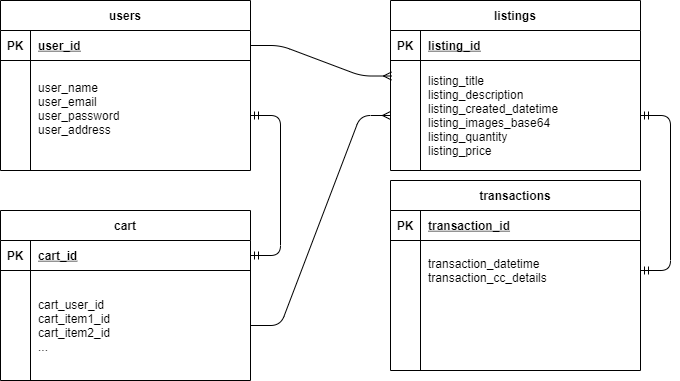

# T2A1-A Workbook - Matthew Sterling

<!-- TOC -->
- [Q1 - Rails Application Architecture](#q1---rails-application-architecture)
- [Q2 - Database Management System](#q2---database-management-system)
    - [Pros](#pros)
    - [Cons](#cons)
- [Q3 - Agile Project Management Implementation](#q3---agile-project-management-implementation)
- [Q4 - Source Control Workflow](#q4---source-control-workflow)
- [Q5 - Software Testing Process](#q5---software-testing-process)
- [Q6 - System Security Requirements](#q6---system-security-requirements)
- [Q7 - Data Protection Methods](#q7---data-protection-methods)
- [Q8 - Legal Obligations](#q8---legal-obligations)
- [Q9 - Relational Database Structure](#q9---relational-database-structure)
- [Q10 - Relational Database Integrity](#q10---relational-database-integrity)
- [Q11 - Relational Database Data Manipulation](#q11---relational-database-data-manipulation)
- [Q12 - Marketplace App Research - eBay](#q12---marketplace-app-research---ebay)
    - [a. List and describe the software used by the app. 2](#a-list-and-describe-the-software-used-by-the-app-sup2sup)
    - [b. Describe the hardware used to host the app. 3](#b-describe-the-hardware-used-to-host-the-app-sup3sup)
    - [c. Describe the interaction of technologies within the app](#c-describe-the-interaction-of-technologies-within-the-app)
    - [d. Describe the way data is structured within the app](#d-describe-the-way-data-is-structured-within-the-app)
    - [e. Identify entities which must be tracked by the app](#e-identify-entities-which-must-be-tracked-by-the-app)
    - [f. Identify the relationships and associations between the entities you have identified in part (e)](#f-identify-the-relationships-and-associations-between-the-entities-you-have-identified-in-part-e)
    - [g. Design a schema using an Entity Relationship Diagram (ERD) appropriate for the database of this website (assuming a relational database model)](#g-design-a-schema-using-an-entity-relationship-diagram-erd-appropriate-for-the-database-of-this-website-assuming-a-relational-database-model)
<!-- /TOC -->

## Q1 - Rails Application Architecture

Rails is a Ruby language framework designed to ease and facilitate the creation of applications and APIs for use cases that require server-side logic, data security and database interaction. As an opinionated framework with an emphasis on "convention over configuration", Rails forces developers to create applications using the **Model/View/Controller (MVC) pattern**. The MVC system allows developers to separate concerns, minimise potential software errors, more easily manage large enterprise applications and adhere to DRY (**D**on't **R**epeat **Y**ourself) coding standards.

Rails applications are executed as a web server that can receive and process HTTP requests from a web browser when accessed via the appropriate IP address and port number, using the MVC system to interact with the user.

The MVC system consists of Models, Views, and Controllers, each serving a specific, discrete purpose to contribute to the function of an application.

- **Models** serve as the backbone of the application; they are the link between the application's code and its database management system. Models contain methods for the creation and manipulation of database records; they are named in the singular, and Rails models will automatically interact with a database table with a name that is the plural form of the model name.

- **Views** contain templates for the information that will be displayed to the user in a web browser. In Rails-only applications they are usually written in **ERB (Embedded Ruby)**, a templating language that allows Ruby to be embedded within HTML code, facilitating dynamic input and output of data when a user interacts with the application.

- **Controllers** are the link between models and views. Using paths outlined in the application's **routes**, which dictate the flow of the application and instruct controllers on which action to call, controllers handle HTTP requests *(GET, POST, CREATE, DELETE)* from specific URLs, and pass objects and variables between the view and the model.

These three discrete parts work together to create a specific flow of information: when an HTTP request is sent to the Rails server via a URL, Rails will check its routes file and call the corresponding method from a controller, which will then interact with methods in the required model. The model will fetch or manipulate data in the database as instructed and pass an object back to the controller, which in turn will forward the object to a view; the view will fetch any assets required (such as CSS files or media files) and then send the information to be rendered to the user's web browser.

## Q2 - Database Management System

A commonly used database management system in Rails and other web framework applications is MongoDB. MongoDB is a document-based NoSQL database, however its design relatively unique as a DBMS in that its design seeks to combine the best features from both traditional SQL-based relational databases and NoSQL databases.

### Pros

-----
- *Scalability* - in contrast to relational databases, MongoDB has high horizontal scalability and is designed to have multiple failure points, allowing for seamless expansion of the database's capability.

- *Flexibility* - unlike the concrete schemata of relational databases, MongoDB allows the structure of existing documents to be live-altered to keep up with the changing needs of an agile business, allowing MongoDB databases to be built and scaled in a modular fashion rather than the traditional requirement of a huge amount of forethought, planning and redundancy implementation.

- *Ease of use* - MongoDB stores data in BSON (Binary JavaScript Object Notation), which especially when working with JavaScript allows developers to interact with the database in a very simple and intuitive way, as information is handled by both the application and database in virtually the same format.

### Cons
-----

- *Availability* - distributed database systems such as MongoDB suffer from endemic problems by nature as described by the CAP theorem (*any distributed system can only provide two of the following: <u>C</u>onsistency, <u>A</u>vailability, and <u>P</u>artition Tolerance*). In pursuit of replicability and data integrity, MongoDB's design sacrifices availability: each copy of the database may only have one primary node which handles all write requests, and if this primary node fails the other nodes must go through a process of electing a new primary node, during which time the database is not able to receive write requests at all.

- *No schema* - the schematic flexibility that allows MongoDB database managers to alter their databases so freely can also cause issues when accessing data. MongoDB does not enforce the same structure for each document in a collection, which can require a great deal of error handling for when an application successfully fetches a document and then is unable to find a specific key-value pair within it.

- *High memory usage* - owing to their requirement of high data redundancy and their need to explicitly store the key name in each key-value pair in every document, MongoDB databases can become very large very quickly.

## Q3 - Agile Project Management Implementation

Agile is a set of guiding principles for efficient and effective project management. As laid out in the Agile Manifesto1, its primary tenets lie in the prioritisation and valuation of:
- "Individuals and interactions over processes and tools";
- "Working software over comprehensive documentation";
- "Customer collaboration over contract negotiation"; and
- "Responding to change over following a plan".

Businesses adopt Agile primarily by implementing a change in management style that requires managers to abandon the traditional methods of micromanagement and specific task delegation in favour of instead empowering their teams to make operational decisions, by delegating high-level objectives only and stepping in only to remove roadblocks or clarify direction.

Agile development is often operated within the Scrum framework, a system which attempts to decrease the time between planning and deployment by breaking software development down into multiple shorter timeblocks called "sprints". in sprints, features of the software are developed in their entirety within a set period, with the goal of creating a Minimum Viable Product that can be potentially deployed to customers in the shortest amount of time, allowing teams to then add more features and iteratively improve the product while it is in use instead of one immutable product at the end of a project.

Agile and Scrum came about as a solution to a number of endemic problems with the older industry standard of "waterfall" development methodology, which required each phase of an application's development to be entirely complete prior to commencing the next, which across a lengthy project timeframe of months or years often resulted in a finished product being obsolete by the time it was released. Agile and Scrum, together emphasising the importance of working closely with the customer to fulfil their needs and of iteratively developing and delivering software that can be more closely fit to their needs, allow development teams to both keep up with the breakneck rate of change of the tech industry in the modern era, and to make better products faster.

## Q4 - Source Control Workflow

Source control is a system for allowing changes to a project with multiple contributors to be easily tracked, merged and reverted, by storing snapshots of different versions of the project's source code files within special folders called repositories. Source control in the software industry is often implemented using a tool called Git, an example workflow of which is provided below:

1. Begin work by initiating a new project with `git init` if a repository does not exist, or cloning an existing repository with `git clone`. Initiating a new repository will enable the tracking of files within that folder; while cloning a repository will download a snapshot of the latest version of a particular project from a hosting server, such as Github or Bitbucket, to a local machine to be worked on.

1. When cloning a repository, any new features that are being worked on will often be done in a different branch of the repository using the `git checkout` command to avoid potential bugs and issues with the main body of the application.

1. Work on the project by making modifications, additions or deletions to files within the project.

1. Once a significant enough amount of work has been done and changes are ready to be added, the user can run `git status` to ensure that all file changes are intended and no accidental file modification has occurred.

1. Once satisfied with the status of the changes, running `git add` will allow the user to add their selected changes to the "staging area".

1. After all desired files are added to the staging area, users may run `git commit` to save a snapshot of their modifications to the repository.

1. If work has been completed in a different branch, a *pull request* may be initiated to merge these changes back into the main branch.

1. The above steps are then repeated until the conclusion of the project.

## Q5 - Software Testing Process

Software testing is the process of performing specific operational tasks on an application in development, which can be done by manually operating the application as a user, or by using scripted testing libraries such as RSpec, Mocha or Selenium.

In manual testing, software testers will:

1. First assess the testing requirements of the application in line with standards and specifications set by the application's documentation;
1. Create a comprehensive "test plan" containing a series of unique test cases designed to assess whether or not the application is operating as expected;
1. Run each of the tests in this plan on the application and document any discrepancies between actual and expected results;
1. Report any bugs to the development team, and re-run the specific tests once any fixes have been applied.

Manual testing is usually executed in stages of increasing complexity in order to easily identify where errors are occurring:

1. *Unit testing* is the most basic level and is done first - ensuring that the smallest discrete pieces of code, such as UI components, are functioning as intended;
2. Next, *integration testing* combines these individual components to ensure they are working cohesively;
3. *System testing* takes this one step further by checking whether all of the integrated parts of the application are working together as intended;
4. Finally, *acceptance testing* is performed to see if the application is suitable for its intended use case in a deployed environment.

## Q6 - System Security Requirements

Information security is an important focus for any online business, however for  e-commerce enterprises it is absolutely critical that appropriate security measures are implemented due to their propensity to be targeted by cybercriminals. By nature of the significant amounts of sensitive personal and financial data that must be stored by online marketplaces, these requirements are: 

- *Encryption and authentication* - personal identities and credit card details must be sent over an encrypted protocol that is protected from unauthorised access and indecipherable even if intercepted;

- *Integrity and irrepudiability* - unmodified records of transactions must be stored on the server and accessible when required to ensure that parties to a transaction cannot deny sending or receiving goods or payments, and that the transaction records cannot be altered;

- *Operational protection* - sufficient systems must be in place to prevent attackers from disrupting the website's operation through Distributed Denial of Service and other similar attacks.

## Q7 - Data Protection Methods

- *User authentication* - ensuring users are who they say they are mitigates the ability of attackers to gain unauthorised access to data. For a marketplace application this is a mandatory requirement, and is usually executed in e-commerce with a simple password login, however this system often proves insufficient due to human fallibility and so I would strongly recommend a two-factor authentication system using the user's smartphone with Google Authenticator or equivalent, biometric verification, or an SMS code to limit fraud.

- *Data protection* - appropriate data server security such as firewalls, hashing algorithms and DDoS protection services such as offered by Cloudflare would be required for the project, as well as use of SSL encryption (HTTPS) to prevent sensitive information from being stolen while being transmitted to the server.

- *Website authenticity* - to prevent users falling victim to phishing and other similar attacks, a security certificate/digital signature system, along with a unique and easily recognisable URL would be applied to the project so that users may verify they are communicating with the true application.

## Q8 - Legal Obligations

In Australia, the handling and storage of sensitive personal and financial information is outlined in the *Privacy Act 1988 (Cth)*. This legislation was enacted to protect the rights of individuals by requiring companies storing sensitive data to adhere to the following principles:

- *Transparency* - compliant entities must permit individuals to request access to any data held about them;
- *Consent* - compliant entities must only collect and store data about individuals with that individual's express consent;
- *Limitation of Purpose* - information collected about an individual can only be used for the explicit purposes for which it is collected;
- *Destruction* - when a compliant entity has no further use for the collected information it must be destroyed.

To this end, the project must contain an End User License Agreement and Privacy Policy which users must agree to before being permitted to use the service, outlining the constraints under which their personal and financial information is collected. Any data stored must be accessible to an individual who can prove their identity, able to be deleted on request, and automatically garbage collected once a user's account has been deleted or made inactive.

## Q9 - Relational Database Structure

Relational databases are structured as a collection of one or more *relations*, commonly conceptualised within SQL-based DBM systems as a *table*. Within each relation are *tuples*, ordered sets of values displayed as rows; and *attributes*, containing an attribute name and an attribute type or *domain*, represented by the columns in the table. Individual database records are required to be stored within the format outlined by the database's *schema*, or data structure, which specifies that the value within a field must match the data type outlined in the attribute.

When an entry is made to a relational database, a new row is created with each value being stored in the appropriate column for its desired attribute, e.g. Name(attribute) -> Keith (value). Tables will usually contain a unique index, often numeric, for each new record to ensure the table row is unique; this X-Y crossover between the ID and the column attribute is what permits data to be later retrieved when queried.

## Q10 - Relational Database Integrity

Data integrity is often defined in these four categories:
 
*Entity integrity* - relational databases must ensure that table rows are unique in order to correctly store and retrieve information. This is usually achieved by defining and enforcing a primary key: a special field that must be unique such as an index, SKU number or ID.

*Referential integrity* - when relationships between two database tables exist, enforcing referential integrity means that the primary key of one table matches the appropriate key of the other table. Enforcing this type of integrity prevents undesired manipulation of table data due to user or program error; this is often done by preventing records from being saved or manipulated unless the data input correctly matches the completeness and format required by the database schemata.

*Domain integrity* - domains in referential databases are strongly defined data types for a particular column, which for example prevent users from entering letters into a phone number field. Domain integrity is concerned with ensuring entries to a field match its preordained domain to avoid data corruption and type errors in an application - this can be achieved by ensuring input forms are engineered to reject or disallow incompatible user inputs.

*User-defined integrity* broadly encompasses anything that is not described by the above three types and permits users to enforce their own data integrity requirements to suit their business needs; this can be implemented by working closely with the customer and tailoring a database to their use case.

## Q11 - Relational Database Data Manipulation

Manipulative aspects of a relational database are usually actioned using a data manipulation language such as Structured Query Language (SQL). Keywords within this language will explicitly instruct the database what to do depending on the desired result. Using SQL as an example, an application will instruct the database to perform a standard CRUD operation using an `INSERT`, `SELECT`, `UPDATE`, or `DELETE` command respectively, along with instructions on which tables/rows to be acted open; the DBMS will interpret this line of code, perform the desired operation and return the requested data to the application.

## Q12 - Marketplace App Research - eBay

### a. List and describe the software used by the app. 2

- eBay runs on a stack comprised of:
    - *Node.js*, the industry-standard JavaScript back-end runtime environment;
    - *Marko*, a JavaScript UI library described as being "10x faster than competing solutions";
    - *Express.js*, a Node framework which drastically simplifies the creation and development of JavaScript-based server-side applications;
    - *Lasso.js*, a JavaScript module bundler that eases the use and packaging of npm packages;
    - *MongoDB*, a NoSQL database management system;
    - and many other microservices and modules.

### b. Describe the hardware used to host the app. 3

- eBay runs on web servers custom-built by eBay. These web servers are gargantuan in scope as they are equipped to handle 500 petabytes of data. Their hardware solution utilises a "Point of Presence" strategy, which enables decentralisation of their web servers, allowing them to more quickly transmit data to customers and significantly reduce loading times for the eBay website.

### c. Describe the interaction of technologies within the app

- Technologies in the eBay stack interact much like any other full-stack application: the front-end UI library displays a webpage to the user, and sends and receives information with the Node/Express backend through HTTP requests; the back-end interacts with the databases performing CRUD operations and serving front-end views to the user.

### d. Describe the way data is structured within the app

- It appears that eBay primarily uses NoSQL databases such as MongoDB, meaning in contrast to relational databases, data is likely stored in *key-value pairs* rather than tables. As a document-drive database management system, MongoDB structures its data in *collections* of *documents* which are queried by looking within specific collections for the desired value from a key.

### e. Identify entities which must be tracked by the app

- Entities that must be tracked by the app include:
    - Users
    - Product Listings
    - Shopping Cart
    - Transactions/Billing

### f. Identify the relationships and associations between the entities you have identified in part (e)

- Users provide the backbone of a two-way marketplace such as eBay.
    - Each user may have many listings;
    - Each listing will generally only have one transaction unless an issue occurs (e.g. a refund); 
    - Each listing will have a buyer and a seller;
    - Each user will have one shopping cart;
    - Each shopping cart may contain multiple products.

### g. Design a schema using an Entity Relationship Diagram (ERD) appropriate for the database of this website (assuming a relational database model)

# References

1. http://agilemanifesto.org/
2. https://www.quora.com/What-technology-is-eBay-built-on?share=1
3. https://www.ebayinc.com/stories/news/ebay-builds-own-servers-intends-to-open-source/

